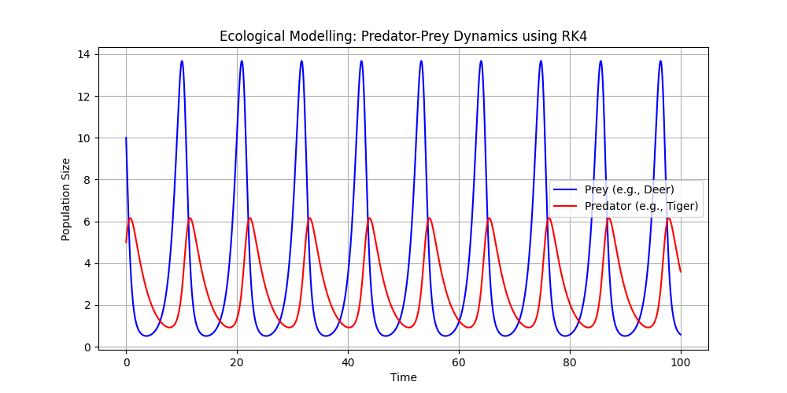

# 🦊 Ecological Modelling: Predator-Prey Dynamics (Coupled ODEs)

This project explores the interaction between two species in an ecosystem using the **Lotka-Volterra Equations**. It demonstrates how a system of coupled differential equations can predict cyclical patterns in nature and industry.

## 🧮 The System of Equations
Unlike simple decay, this model relies on two interdependent variables:

1. **Prey Population ($x$):** $\frac{dx}{dt} = \alpha x - \beta xy$
2. **Predator Population ($y$):** $\frac{dy}{dt} = \delta xy - \gamma y$

These equations are "coupled" because the growth of one population directly impacts the survival of the other.

## 🛠️ Numerical Solution (Vectorized RK4)
I implemented a **Vectorized 4th Order Runge-Kutta (RK4)** solver. This allows the algorithm to handle multiple state variables simultaneously, providing high precision in capturing the oscillatory nature of the system.

## 📊 Results
The simulation reveals the natural "balance" of the ecosystem. When the prey population increases, the predators thrive, which eventually leads to a decrease in prey, and the cycle continues.

## 🌍 Real-world Applications
- **Resource Management:** Modelling sustainable harvesting of fish or timber.
- **Biochemical Reactions:** Simulating oscillating chemical reactions in industrial reactors.
- **Economics:** Modelling interaction between two competing market forces.
